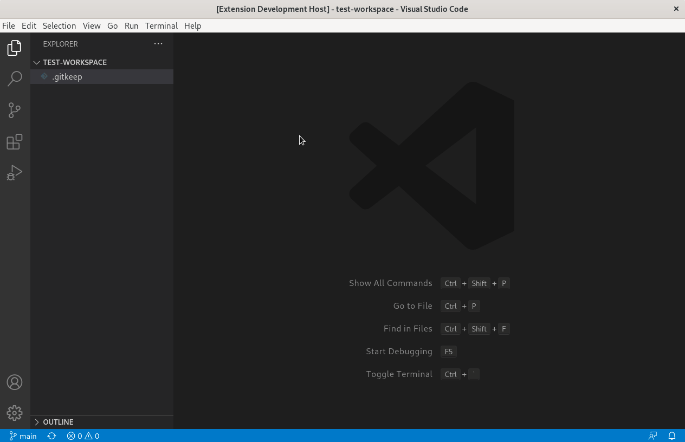

# OCM VScode Extension

 "ocm-vscode-extension" helps creating OCM cluster applications. 

## Current Features

- Loading OCM crd snippets from the command pallette OCM 

- Create a sample Git-type Application Lifecycle Project

## Requirements
  
 - To apply generated resources the [Application Lifecycle Management Addon][0] should be installed and enabled in your hub/managed clusters.

## Road Map 
 - Execute [clusteradm](https://github.com/open-cluster-management-io/clusteradm) commands.
 - Query hub/managed cluster resources  

## Contributing 
See our [Contributing Document](.github/CONTRIBUTING.md) for more information

[0]: https://open-cluster-management.io/getting-started/integration/app-lifecycle/
